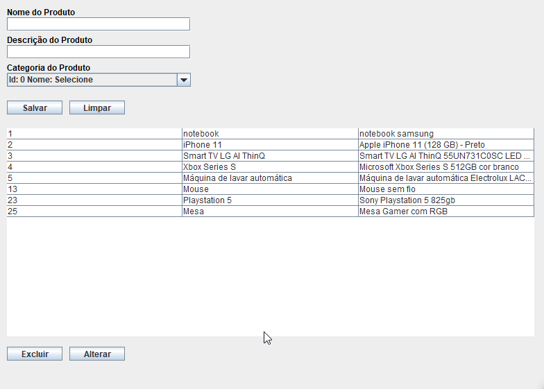

# Java e JDBC: Trabalhando com um banco de dados

##### Neste curso aprendi a:

- [X] Comunicar-me com um banco de dados relacional
- [X] Ir além do Statement e do ResultSet
- [X] Encapsular o acesso em um DAO
- [X] Connection pool, datasources e outros recursos importantes